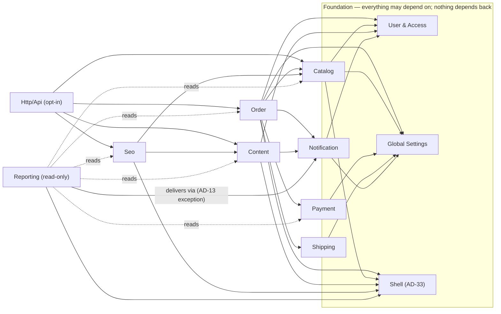
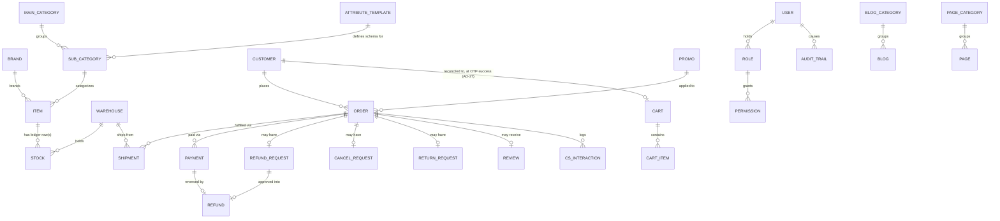

# Architecture Spine — Bazaar

## Design Paradigm

**Modular Monolith**: one Composer package, one Filament panel, one deployable unit per client install — organized into domain-grouped internal modules (`src/{Domain}/`) that may only interact through each other's Service layer, never through direct model access (AD-6).

**Hexagonal ports-and-adapters** is used, but scoped narrowly to the two places the system genuinely crosses an external technical boundary: payment and shipping. `PaymentGateway` and `ShippingGateway` are ports (`src/Payment/Contracts`, `src/Shipping/Contracts`); Midtrans and RajaOngkir are the v1 adapters, shipped in the same package (AD-4, AD-11). No other domain gets a port — Catalog, Order, Content, Reporting, etc. have no external system to abstract; their boundary discipline is pure Service→Action→Model layering (AD-5).

## Invariants & Rules

*`[ADOPTED]` marks an AD that was already settled by the PRD/addendum before this architecture run — restated here, not re-decided. An untagged AD was decided during this session's coaching conversation with the user.*

### AD-1 — Single-package boundary `[ADOPTED]`

- **Binds:** all
- **Prevents:** fragmenting into core/admin/gateway repos, each with its own version matrix, CI, and release coordination overhead
- **Rule:** All domain logic and the Filament admin panel ship in one Composer package (`tigaphonic/bazaar`). No submodule is split into its own installable package absent a demonstrated need.

### AD-2 — Filament-locked admin `[ADOPTED]`

- **Binds:** all Filament-facing code
- **Prevents:** an admin-panel abstraction layer that will never be exercised
- **Rule:** The admin UI is built directly against Filament; there is no swappable-panel abstraction. Per-client visual differences go through Filament's own theme-override mechanism (paired with `DESIGN.md` tokens), never a second panel implementation.

### AD-3 — Headless boundary `[ADOPTED]`

- **Binds:** all domains
- **Prevents:** the package rendering any customer-facing HTML/JSON meant for direct browser consumption by an end-buyer
- **Rule:** Bazaar never renders a customer-facing page. Every domain exposes its capability through its Service layer; an optional, config-registered thin API Layer (Sanctum + API Resource) sits on top for headless clients, enabled per install via `config('bazaar.api.enabled')`, never forced on.

### AD-4 — Gateway contracts live in-package `[ADOPTED]`

- **Binds:** Payment, Shipping
- **Prevents:** extraction pressure toward a "reusable gateway package" before a second real consumer justifies it
- **Rule:** `PaymentGateway` and `ShippingGateway` interfaces, and their concrete v1 implementations (AD-11), both live inside `tigaphonic/bazaar`. No extraction until a second, real, non-Bazaar consumer exists.

### AD-5 — Domain-grouped modules, Service→Action→Model layering `[ADOPTED]`

- **Binds:** all domains
- **Prevents:** business logic leaking into Filament Resources/Controllers/Blade; two developers inventing different internal layering per domain
- **Rule:** Each domain is its own namespace (`src/{Domain}/{Models,Services,Actions,Enums,States,Events,Filament}`). Call order is Service (primary entry point) → Action (escape hatch for multi-step/complex operations) → Model method (reusable predicate, never a mutating side-effect). Presentation code (Filament Resource, Controller, Blade) may only call a Service. This rule (and AD-6's cross-domain discipline) is enforced by an automated architecture test using the scaffold's existing `pestphp/pest-plugin-arch` — asserting no domain's `Models\*`/`Actions\*` are `use`d from outside that domain's own namespace except through its `Services\*` — not code-review discipline alone.

### AD-6 — Cross-domain only via Service; Events for reverse-direction `[ADOPTED]`

- **Binds:** all domains
- **Prevents:** domain A reaching into domain B's models directly; reverse-direction coupling (e.g. Payment mutating Order state directly instead of Order reacting to it); building broadcast/WebSocket infrastructure to push these Events onward
- **Rule:** Domain A needing domain B always calls domain B's Service — never its Model or Action. Each domain-pair dependency is one-directional (see the diagram under Structural Seed); where B must notify A of something, B dispatches a Laravel Event that A listens for, rather than calling back into A. Bazaar dispatches these Events passively only — it never ships a broadcast driver/channel or any real-time push infrastructure (PRD §5 permanent Non-Goal); a portal that wants real-time UX subscribes to the Events itself and builds its own transport.

### AD-7 — Snapshot principle `[ADOPTED]`

- **Binds:** Order, Payment, Shipping, Promo — anywhere a transaction records a value from mutable master data; extends to any Event a domain-mutation dispatches for a queued listener to render later
- **Prevents:** a transaction record silently changing meaning when master data (price, warehouse address, shipping cost, promo terms) changes later; a delayed queued listener re-fetching live data that has since drifted from what was true when the triggering Event fired
- **Rule:** Any mutable master-data value a transaction references is copied onto the transaction record at the moment the transaction happens; it is never resolved live afterward. The same discipline extends to Events that feed Notification's queued listeners (AD-6, AD-17): the Event payload itself carries the rendering-relevant data as a snapshot (e.g. `OrderCompleted`'s payload includes the total/item list at completion time, not just an id) — a listener that runs minutes later after a queue backlog must never re-resolve the live record to fill in what changed in between.

### AD-8 — Atomic reservation, no read-then-write `[ADOPTED]`

- **Binds:** Catalog (Stock), Order (Promo redemption)
- **Prevents:** race conditions double-selling the same unit, or over-redeeming a Promo's last quota slot, under concurrent checkout; Catalog reaching into Order's tables to answer "is this still held" (which would violate AD-6's one-directional rule)
- **Rule:** Every stock-locking or quota-locking operation is a single conditional atomic `UPDATE` with a `WHERE` guard (e.g. `WHERE (quantity_on_hand - quantity_reserved) >= N`) — never a separate read followed by a write. `Stock.quantity_reserved` is the sole source of truth for "is a unit currently held by some active Order" (FR-30's visibility rule): Order is responsible for keeping it accurate via its own calls into Catalog's Service at every relevant transition — reserve at checkout-attempt start (AD-27), release on cancel/timeout, decrement alongside `quantity_on_hand` on payment settlement, and **increment `quantity_on_hand` back on an approved-and-physically-received Return** (the sole restock trigger — no separate manual "adjust stock" UI exists for this flow, and no other trigger restocks). Catalog's availability/visibility query never itself reads Order's tables. Every reservation call into Catalog's Service returns the `warehouse_id` of the `Stock` row it reserved against (Pooled and Serialized alike, already present on that row per the Default-Warehouse resolution) — Order's Shipment-splitting groups by this returned value uniformly, with no Pooled/Serialized special-casing.

### AD-9 — Unified inventory mechanism `[ADOPTED]`

- **Binds:** Catalog (Item, Stock)
- **Prevents:** two parallel locking/schema systems for New/Pooled vs Second/Serialized inventory; a DB-level constraint that would block the deferred (not permanently-excluded) multi-warehouse-per-Item feature from ever landing without a breaking migration
- **Rule:** Pooled and Serialized Items share one `Stock` schema and one reservation mechanism. Serialized permanently fixes `quantity_on_hand` at 1 and toggles `quantity_reserved` 0/1 through the same atomic path as Pooled — never a separate serialized-only code path. Pooled's "1 Stock row per Item" limit is enforced at the **Service validation layer only, never a DB constraint** — intentionally soft, so it can be loosened later without a migration when multi-warehouse Pooled stock is needed (§6.2). Serialized's 1-row limit is permanent and may be enforced at either layer.

### AD-10 — No `tenant_id`; one database per install `[ADOPTED]`

- **Binds:** all domains
- **Prevents:** multi-tenant SaaS assumptions (shared DB, tenant-scoped queries, a workspace switcher) creeping into a package that is deliberately one-install-per-client
- **Rule:** No schema anywhere carries a `tenant_id` column or a tenant-scoping query concern. Each Bazaar install is its own app + database.

### AD-11 — Concrete v1 gateway targets & headless payment/shipping boundary `[ADOPTED]`

- **Binds:** Payment, Shipping
- **Prevents:** the package acquiring any payment/shipping UI surface (undermining AD-3); a Snap-style hosted checkout leaking presentation concerns into the package
- **Rule:** v1 ships `MidtransPaymentGateway` (Core API only, never Snap) and `RajaOngkirShippingGateway` as the concrete adapters for AD-4's ports. Bazaar creates the Payment transaction, receives/processes the gateway callback/webhook, and calls the shipping API for rate-check/AWB creation — and renders zero payment or shipping UI; that is entirely the portal's responsibility. A gateway being active does not mean every method it supports is open to Customers: both the "available payment methods" service (FR-16) and the transaction-creation service filter against the explicit enabled-methods list in Global Settings — never Midtrans's full supported-method list by default. `ShippingGateway`'s status-sync contract must accommodate **both** inbound webhook and outbound polling, since the concrete v1 adapter's capability decides which mode(s) RajaOngkir actually needs — this choice is deferred to adapter implementation, not fixed here. **The webhook/callback routes themselves are registered by `Payment`/`Shipping` directly, always on, regardless of whether the optional API Layer (AD-3, `bazaar.api.enabled`) is enabled** — a pure Service-Layer/monolith install (FR-34) still needs Midtrans/RajaOngkir to reach Bazaar server-to-server; this is not part of the opt-in headless API surface.

### AD-12 — Order status model & transition discipline `[ADOPTED]`

- **Binds:** Order, Shipment
- **Prevents:** Payment/Order/Shipping status collapsing into one composite field; a cancelled timer racing a just-fired scheduled job; an unguarded transition corrupting state under concurrent access; repeated clicks on an action button producing duplicate side effects
- **Rule:** Order carries 3 independent status layers (Payment/Order/Shipping Status), never conflated. `Shipment` is a distinct entity, one Order : many Shipment (one per Warehouse involved). Transitions use `spatie/laravel-model-states`; the orchestrated pattern (DB transaction + rollback) applies when a transition needs rollback safety, event-driven/queued applies for retryable side effects. Every scheduled/delayed job (payment timeout, review deadline, tokenized-link expiry) re-checks current state as a guard condition before acting — the timer firing is never authoritative on its own. The same guard discipline covers Staff-triggered actions repeated by accident: AWB creation is guarded by a unique constraint/lock on Shipment (`awb_number` + a "registering" status checked before a second call is allowed) so a double-click never creates a duplicate AWB; `awb_number`/`courier` stay Staff-writable as a manual fallback whenever vendor calls keep failing. **Stock release (AD-8) on Order cancellation/timeout lives in exactly one place: the `OrderStatus` state class's own transition hook into `Cancelled`.** Every path that cancels an Order — a Staff-initiated `CancelOrderAction`, the payment-timeout job, an approved Return/Retur — goes *through* that state transition and never calls Catalog's release directly from outside it; this is the one code path that touches `StockService::release`, so no route can silently skip it.

### AD-13 — Reporting: one-directional read-only dependency `[ADOPTED]`

- **Binds:** Reporting
- **Prevents:** a cycle where another domain depends back on Reporting, forcing analytical read-load into other domains' write paths
- **Rule:** Reporting may read any domain's Service. No domain may depend on Reporting. **One explicit exception**: delivering a `ReportSchedule`'s generated export (AD-28) calls into Notification's dispatch Service rather than sending mail directly — so every scheduled-report delivery lands in `NotificationLog` (FR-27) and goes through `NotificationTemplate` like any other outbound communication. This is Reporting's only permitted write-shaped dependency.

### AD-14 — Notification's four separated concerns `[ADOPTED]`

- **Binds:** Notification, all domains (as dispatchers)
- **Prevents:** centralizing trigger logic into the Notification domain (making it a bottleneck every domain must call into); conflating customer-facing Notification with Staff in-app alerts
- **Rule:** (1) Dispatch/trigger stays decentralized — each domain fires its own Laravel Events. The Notification domain owns only (2) Notification Template (admin-editable content) and (3) Notification Log (delivery history, resend). (4) `StaffNotification` (in-app, role-targeted) is a wholly separate model and listener path from (2)/(3) — never merged into the same table or delivery channel. Every `StaffNotification` carries a polymorphic reference to its source record (entity type + id) plus an optional tab-anchor, so the dashboard bell can deep-link straight to the exact record and tab (EXPERIENCE.md component pattern) rather than a generic list page. The tab-anchor's value is always the target Filament Resource's tab **key** (the machine identifier Filament's own tab API expects, e.g. `pending_review`) — never a display label — so the one shared bell-renderer resolves every domain's anchor the same way.

### AD-15 — Feature combinations are data-driven, not config-gated

- **Binds:** Catalog (Condition × Inventory Strategy)
- **Prevents:** building a per-install config-flag layer that gates UI/menus/validation by which combination a client happens to use
- **Rule:** Every domain, field, and menu is present in every install regardless of which Condition × Inventory Strategy combinations a client actually exercises. A New-only client simply never creates a Second-condition Item; there is no installation-level toggle.

### AD-16 — Three formal extension seams; no forking

- **Binds:** all domains
- **Prevents:** client-specific logic hand-patched into package source (forking), causing per-client Bazaar codebases to silently diverge
- **Rule:** Any point where client-specific behavior is plausible is built behind exactly one of:
  1. **Container binding override** — the Action/Service is resolved via an interface; a client app's own `ServiceProvider` rebinds it.
  2. **Laravel Events** — the sanctioned seam for additive side-effects/reactions (the AD-6 backbone).
  3. **Config-registered Filament Resource class** (`config('bazaar.resources.*')`) — a client overrides the entry to their own subclass instead of editing the package's Resource.

  No class in the package is "just edit it directly." *(Amended 2026-09-14, AD-33: this prohibition covers Shell's shipped compiled assets — its CSS/JS in `vendor/` — the same as it covers classes; hand-patching the compiled output is forking, not a seam, even though it's a file and not a class.)*

### AD-17 — Operational health-check: pull-based queue/scheduler heartbeat

- **Binds:** Order (timeout/deadline jobs), Notification, Settings
- **Prevents:** a dead scheduler or queue worker silently breaking auto-cancellation/auto-completion/notification dispatch with no visible symptom; the self-defeating design of detecting "the scheduler is dead" through a mechanism that itself depends on the scheduler
- **Rule:** A frequent trivial scheduled task writes a `scheduler_last_tick` timestamp; the same task dispatches a trivial queued job that writes `queue_last_processed` when actually executed. Staleness is evaluated on **pull** (page render / CLI call), never on push: via `bazaar:status` (Artisan — usable any time post-install, not just at install, to catch config drift) and a Global Settings dashboard widget. When staleness crosses a threshold and no active alert already exists, a `StaffNotification` (AD-14) is raised to the ops-permission Role.

### AD-18 — Identifiers: ULID for Bazaar-owned tables + transaction numbers

- **Binds:** all domains
- **Prevents:** domains picking different PK strategies (leaking sequential business volume in some tables but not others); UUIDv4-style random-insert index fragmentation on high-concurrency tables (Stock, under AD-8); vendor migrations hand-patched to force a PK type they were never designed around
- **Rule:** Every Model whose migration is authored by Bazaar itself uses a ULID primary key (Laravel's native `HasUlids`), no exception. Tables and identifiers owned by a first-party Laravel/ecosystem dependency — Laravel's own `users` table, `spatie/laravel-permission`'s tables, Sanctum's `personal_access_tokens`, `spatie/laravel-settings`' own storage — keep that dependency's native schema unmodified; Bazaar never hand-edits a vendor migration to force ULID, and any Bazaar-owned FK column pointing at such a table matches that table's native key type rather than assuming ULID. This scoping holds because the leakage/fragmentation risks above are about Bazaar's own business-data tables, not low-write identity/RBAC tables a dependency already ships and maintains. Transactional entities meant for human reference — Order, Payment, RefundRequest, Shipment, CancelRequest, ReturnRequest — additionally carry a human-readable transaction number (e.g. `ORD-20260912-000123`). All of them are generated through **one shared mechanism**: a single `transaction_counters` table keyed by `(prefix, date)`, mutated only via the same atomic guarded-`UPDATE` pattern as AD-8 — never `spatie/laravel-settings` or any cached/non-atomic read-then-write, which cannot satisfy this AD's own no-collision guarantee under concurrent checkout. One implementation, reused by every entity in this list — never reinvented per domain.

### AD-19 — Money stored as whole-Rupiah integer

- **Binds:** Catalog (Item price), Payment, RefundRequest, Order (total)
- **Prevents:** floating-point rounding error entering any financial computation
- **Rule:** Every monetary field is an unsigned bigint counting whole Rupiah — never `decimal`/`float`. Consistent with the current IDR-only, no-subunit scope (PRD §6.2 Out of Scope for MVP — revisitable, not a permanent Non-Goal; multi-currency would need its own migration path if it's ever taken up).

### AD-20 — Separate auth realms; API Layer authenticates per-service

- **Binds:** User, Customer, Http/Api
- **Prevents:** a shared auth table blurring Staff and Customer identity; each client's frontend team inventing a different assumption about what a Sanctum token represents
- **Rule:** `User` (Staff) and `Customer` are fully separate realms — no shared table — and `Customer` never authenticates through Laravel's **auth guard/session system** in v1 (tokenized-link access only). This is distinct from AD-27's OTP checkout verification, which is a transient per-checkout gate, not a login — it creates no session and no Laravel-auth identity, so it does not contradict this AD. The optional API Layer's Sanctum token authenticates the client's portal **service** (server-to-server), not an individual Customer; guest-facing endpoints (cart, checkout, availability-check) need no per-end-user token. Per-Customer personal access tokens are a v2/Member-Login-era concern, not built now.

### AD-21 — `config` vs `Settings`: deploy-time vs runtime-editable

- **Binds:** Settings, all domains that read configuration
- **Prevents:** a Timeout Timer or gateway credential hardcoded in a config file (unreachable to Staff without a deploy); a structural choice like a Resource override ending up in the DB-backed Settings
- **Rule:** `config/bazaar.php` holds only deploy-time/structural values (including AD-16 seam-3 Resource-class overrides). `spatie/laravel-settings` holds only runtime, staff-editable operational parameters (Global Settings, FR-28/29). Neither mechanism is ever used for the other's concern; credential fields (Midtrans server key, RajaOngkir API key) use `laravel-settings`' encrypted-property cast.

### AD-22 — Four distinct log-like mechanisms

- **Binds:** all domains
- **Prevents:** business audit history landing in the technical Laravel log (unsearchable by Staff), or vice versa
- **Rule:** `Log::` (technical/debug — gateway request/response, errors) ≠ `AuditTrail` via `spatie/laravel-activitylog` (business mutation history, FR-20) ≠ `NotificationLog` (customer delivery history, FR-27) ≠ `StaffNotification` (in-app alerts, FR-32). Each is its own storage and its own audience; none absorbs another's entries.

### AD-23 — Database engine-agnostic construction

- **Binds:** all domains
- **Prevents:** a migration or query quietly using a MySQL-only (or Postgres-only) feature, silently breaking the other engine
- **Rule:** MySQL and PostgreSQL are both first-class supported targets. Schema and queries stay engine-agnostic by construction — Eloquent JSON casts (not raw MySQL JSON functions), AD-8's atomic `UPDATE...WHERE` pattern (portable to both), no engine-specific SQL anywhere.

### AD-24 — Package release discipline

- **Binds:** the package as a whole
- **Prevents:** a client's independently-timed `composer update` hitting a destructive migration or a silently-broken Service contract
- **Rule:** Semver. Migrations are additive/non-destructive by default; any breaking schema or Service-contract change requires a major version bump plus a documented upgrade path.

### AD-25 — Attribute Template snapshot `[ADOPTED]`

- **Binds:** Catalog (Item, AttributeTemplate)
- **Prevents:** editing a Sub-Category's AttributeTemplate silently rewriting every existing Item's stored attribute values
- **Rule:** `Item.attribute_snapshot` is copied from the Sub-Category's AttributeTemplate at create/last-reconcile time — never a live FK. Editing the template only writes the master row; a staff-triggered reconcile action merges added/removed fields into a snapshot without touching fields present in both.

### AD-26 — Customer: guest-first, auth-ready `[ADOPTED]`

- **Binds:** Order (Customer)
- **Prevents:** a Member-Login v2 rollout requiring a data migration to merge a "guest customers" table into an "authenticated users" table
- **Rule:** `Customer` is one table from day one, with nullable `password`/`email_verified_at` columns present but unused in v1 — guest checkout is create-or-find by email; Member Login is purely additive later. Before a `Customer` exists, `Cart` is keyed by a signed anonymous token (cookie/local-storage), with `customer_id` nullable; `CheckoutAction` attaches `customer_id` to that same `Cart` row at OTP-success time (AD-27) — this is the only reconciliation point between anonymous browsing identity and a resolved `Customer`.

### AD-27 — OTP checkout verification is a transient gate, not authentication

- **Binds:** Order (checkout)
- **Prevents:** OTP verification being designed as a login/session mechanism (which would contradict AD-20's guest-first stance); OTP living nowhere and getting reinvented ad hoc inside the checkout Action
- **Rule:** Every checkout (100% guest in v1) passes an OTP step, owned by Order's `CheckoutAction`, before an Order is confirmed to the "diproses" stage (FR-9). The code is a short-lived value tied to the checkout attempt, never a Laravel-auth credential — it produces no session and no `Customer` login state. Its expiry duration is a Timeout Timer value in Global Settings (FR-28), read via `Settings`, never hardcoded. `NotificationTemplate`'s "OTP Checkout" trigger point (FR-26) is what actually delivers the code. **`checkout-start` (AD-8's reservation trigger point) is pinned to the moment the checkout attempt begins — before OTP is sent, not after it succeeds** — using a short-lived reservation tied to the checkout attempt's own token/expiry (independent of Order-level timeout, since no `Order` row exists yet at this point); this trades a slightly earlier reservation for never letting a Customer pass OTP only to find the item already gone.

### AD-28 — Reporting exports & scheduled reports need their own persisted model

- **Binds:** Reporting
- **Prevents:** ad hoc, per-report-page export code with no shared mechanism; "scheduled report" (FR-25) having no record of what runs, for whom, how often, or in what format
- **Rule:** A `ReportSchedule` model (owned by Reporting) persists what report, which filters, what format (CSV/XLSX/PDF), which recipients, and what cadence — the same kind of first-class treatment AD-14 gives Notification's own scheduling concerns. Generation is queued (never synchronous on the request that triggers it) and reuses AD-17's queue/scheduler envelope. CSV/XLSX export uses `maatwebsite/excel`; PDF export uses `barryvdh/laravel-dompdf` (see Stack) — one mechanism each, shared by every report, not reinvented per report category.

### AD-29 — Approvals Inbox is a cross-domain read, not a domain of its own

- **Binds:** User (hosts the surface), Catalog, Content, Order, Payment (owning domains of the approvable items)
- **Prevents:** the Approvals Inbox being implemented as an ad hoc query bolted onto one domain, or duplicated per-domain, instead of one governed aggregation; a Staff member seeing a pending item they have no permission to act on
- **Rule:** The Approvals Inbox is a Filament-only aggregation surface (`User/Filament/Pages/ApprovalsInbox.php`) — not a new domain and not a new table of its own. It reads pending Items (Catalog), pending Blog/Page (Content), pending Reviews/CancelRequest/ReturnRequest (Order), and pending RefundRequest (Payment) each via that domain's own Service (AD-6 still holds — it never queries another domain's models directly), filtered to what the viewing Staff's Role actually holds permission to act on. Approve/reject actions are executed by calling back into the same owning domain's Service — the Inbox itself mutates nothing directly. Every owning domain's Service exposes this through **one shared contract**: `pendingFor(User $staff): Collection<PendingApprovalItem>` (a common DTO shape, not a per-domain bespoke return type), and the permission check behind it is always a record-scoped Policy — never a mix of blanket-role checks in one domain and per-record Policies in another.

### AD-30 — SEO metadata is inline, never a shared model

- **Binds:** Catalog (Item, Category), Content (Blog, Page)
- **Prevents:** Catalog quietly depending on a Content-owned `SeoMeta` model to get SEO fields onto Item/Category (which would both violate AD-6 and contradict FR-24's own text); two domains disagreeing on whether SEO metadata is a shared table or per-entity columns
- **Rule:** Per FR-24 ("bukan CRUD/module terpisah"), SEO metadata (Meta Title/Description, Canonical URL, OG fields) is a set of plain columns added directly to each of Item, Category, Blog, and Page's own table — never a separate `SeoMeta` model or a cross-domain reference. Each domain owns its own entities' SEO columns; there is no dependency between Catalog and Content for this.

### AD-31 — Media-optimization is one shared pipeline, not a per-domain feature

- **Binds:** Catalog (Item), Content (HeroBanner, Blog, Page), Settings (Store logo/favicon)
- **Prevents:** three domains each hooking their own upload points with three different compression implementations, producing inconsistent output formats/quality across the admin
- **Rule:** Every image upload across every domain (FR-36) runs through **one shared media pipeline** (`spatie/laravel-medialibrary` conversions), hooked once and reused — not reimplemented per domain. The original file is retained as source; the compressed/WebP variant is a separate media conversion served by Service/API, never an in-place overwrite.

### AD-32 — Unauthenticated inbound write endpoints are rate-limited by default

- **Binds:** Seo (BrokenLinkLog / FR-40), and any future unauthenticated portal-initiated write endpoint
- **Prevents:** an unauthenticated, portal-triggered write endpoint (no Customer/User identity to hold accountable) being left open to unbounded volume — flagged by the addendum itself as an architecture-owned decision, not a product one
- **Rule:** FR-40's broken-link-report endpoint sits behind Laravel's rate-limiting middleware from day one — this is a fixed invariant, not optional. The concrete threshold/window is implementation detail (Deferred); that *some* throttle exists is not.

### AD-33 — Shell: Foundation-tier UI substrate, self-contained Tailwind-built theme

- **Binds:** every domain that renders a Filament UI (all of them) — raised by Story 1.2's ATDD run (bmad-tea), which found this spine had no architectural home for the DESIGN.md token system at all
- **Prevents:** (a) the DESIGN.md token system / reusable UI kit being rebuilt or drifting per-domain instead of shared once; (b) a client's host app needing its own Tailwind/Node build just to render Bazaar's panel, which would break Story 1.1's "composer require + one Artisan command, no greenfield scaffold" install promise; (c) Bazaar's own visual token layer silently diverging from DESIGN.md through ad hoc per-screen CSS; (d) a developer reopening the same "host app needs Node" hole through the JS half of the component kit (Modal/Toast/Tabs/Dropzone), or through an install-time build hook, after the CSS half is closed; (e) Shell and Settings (AD-21) both plausibly owning per-Staff theme/locale preference and diverging on it
- **Rule:** A new Foundation-tier domain, `src/Shell`, owns the DESIGN.md token system (as a Filament panel theme override, never the stock Filament theme) plus the reusable UI kit (Data Table, Modal, Toast, Tabs, Pagination, Empty State, Alert Banner, Dropzone) plus bilingual EN/ID and dual light/dark-theme mechanics. It sits alongside User & Settings in the Foundation tier — every other domain depends on it for its Filament UI (see the explicit edges added to the Structural Seed diagram); it depends on nothing else in-package, so it may never itself depend on User or Settings (that would be a cycle no other AD would catch). Unlike the FR-mapped domains, Shell is cross-cutting substrate, not itself an FR area (Capability → Architecture Map below is unchanged).

  **Both CSS and JS** for the component kit are Tailwind v4 / vanilla-or-Alpine JS (Filament v5's own theming target — verified 2026-09-14, CSS-first config, no `tailwind.config.js`) **compiled once, at Bazaar's own dev/release time only, and committed as static package assets** — never generated, rebuilt, or fetched at install time or on any client request (`bazaar:install`/`bazaar:status` must never shell out to `npm`/`node`; that would reintroduce the Node dependency this AD exists to remove). Tailwind/PostCSS/Node are devDependencies of the Bazaar repo itself, never a runtime requirement for a client's host app.

  **Exact registration shape (unambiguous — only this shape satisfies this AD):** `FilamentAsset::register([Css::make('bazaar-shell', __DIR__.'/../../resources/dist/shell.css'), Js::make('bazaar-shell', __DIR__.'/../../resources/dist/shell.js')])` in `packageBooted()`, with the panel then referencing the *registered id* — `$panel->theme('bazaar-shell')` (which resolves the already-registered asset; see `Filament\Panel\Concerns\HasTheme::getTheme()`), never `$panel->viteTheme(...)`, which is Filament's Vite-paired API and would require a host-side Vite build. `Css`/`Js` are Filament's own pre-built-static-asset primitives (`Filament\Support\Assets\{Css,Js}`) — both take a plain file path, no build step to consume.

  This is a **deliberate departure** from Filament's own generic plugin-theming guidance — verified 2026-09-14 against the current `filamentphp/plugin-skeleton` README, which actually recommends the opposite ("purist") pattern: the consuming app adds the plugin's Blade paths to its own `@source` directive and compiles its own Tailwind build. That default is correct for a plugin riding on an app that already has its own Filament theme pipeline; it's wrong for Bazaar specifically, because Bazaar *is* the panel's whole theme (DESIGN.md, not a per-client addition) and Story 1.1 promises zero manual setup. The self-contained pre-built path instead follows the technique documented by [Adam Weston](https://aw.codes/blog/keep-your-filament-plugins-light) — purge Shell's compiled output against Filament core's own shipped classes to avoid duplication — since that's real-world precedent for plugin authors who *do* need to ship pre-built CSS, which the current plugin-skeleton itself does not attempt.

  **Per-Staff theme/locale preference is Shell-owned data**, not `Settings`/AD-21 (which governs install-wide, deploy-time-vs-runtime-editable *operational* parameters — not a per-User preference). It persists in a Bazaar-owned table (ULID PK per AD-18's default), never a column on the host app's own `users` table, consistent with AD-18's amendment scoping Bazaar away from owning host-app tables.

  **No shortcut around the still-undesigned client override seam:** until AD-16's fourth seam (Deferred) is actually designed, no domain may add a raw-CSS-injection escape hatch (e.g. a `custom_css` field on Settings rendered into a `<style>` tag via a render hook) to unblock a client wanting brand colors — that would ship an unreviewed seam through the back door, with no CSP/injection review, that other clients then start depending on. A client wanting visual customization before the fourth seam exists is a Deferred limitation, not a reason to invent one under deadline pressure.

  **Single owner of Filament asset registration:** only Shell's own `ServiceProvider` may call `FilamentAsset::register()` for CSS/JS. Other domains consume Shell's kit through its Blade components; they never register their own Filament CSS/JS assets — this keeps asset-key ownership and load order unambiguous as more domains ship UI.

  **Scope relative to AD-5:** Shell has no `Models`/`Actions` and is carved out of AD-5's Service-call discipline — it is pure presentation substrate (Blade/Livewire + compiled assets), not a business-logic domain. Other domains' Filament Resources may reference Shell's Blade components directly; this is not a violation of "presentation code may only call a Service," since Shell has no Service to bypass.

  **Shell is the admin/staff Filament panel only — it never reaches the customer-facing storefront.** Confirmed with the user: the admin dashboard is built entirely on Filament's own primitives (Resource/Page/Table Builder/Notifications/etc.), Tailwind-themed by Shell, never Filament's stock appearance. The storefront stays governed entirely by AD-3's two pre-existing integration paths (Service Layer, consumed directly by a client's own Laravel/Livewire build; or the optional Sanctum API Layer for a headless frontend) — Bazaar ships **zero** storefront UI or styling either way; that is the client's own build regardless of which path they pick. Shell's component kit is not required to be portable outside Filament.

  **Which components restyle Filament's own primitives vs. are built net-new is fixed per-component by DESIGN.md's own visual-design tagging, checked against what Filament core actually ships — not by one blanket policy here, and not by DESIGN.md's tag alone.** *(Corrected 2026-09-14 — Murat/bmad-tea's Story 1.2 ATDD re-check independently verified this against `vendor/filament/*` and the web rather than trusting the classification below at face value, and caught a real self-contradiction: the first version of this AD named "Notifications" as a restyled primitive while separately classifying Toast — Filament's own Notification system — as having no Filament equivalent.)* DESIGN.md's own "Net-new" tag means *no reference-mockup precedent existed*, which is not always the same question as *no Filament primitive exists* — the two coincide for most of the list but not all of it:

  - **Net-new** (no reference-mockup precedent **and** no adequate Filament primitive, built from scratch as Blade/Livewire): Modal, Tabs, Pagination, Empty State, the Countdown/Deadline Indicator, and **Alert Banner** — verified 2026-09-14 that Filament core ships no alert/banner component at all; only third-party plugins fill this gap.
  - **Restyle Filament's own primitives**: Data Table (Table Builder), Sidebar, Topbar, Notification Dropdown, Card, Stat Card, Status Pills (Badge), Button, Form Input/Select, and **Toast** — Filament's native `Filament\Notifications\Notification` system (confirmed via its `assertNotified()` test helper) already is a transient, dismissible, positioned toast; Shell themes it rather than rebuilding one in parallel.

  A Shell implementer follows this list component-by-component; this AD fixes only that the *decision rule* is DESIGN.md's tag **cross-checked against Filament's real primitives**, not a developer's unchecked individual judgment call, and not either source alone.

  **Consequence, fixed here so it isn't re-litigated per story:** Node/npm/Tailwind are now legitimate, real **dev-time tooling** in this repo (never client-runtime infrastructure — see Deployment & operational envelope, which is about what a client's install must provide, and stays unchanged by this AD) — this is the deciding constraint for any browser-based test tooling Shell's visual/runtime behavior needs; the concrete tool choice itself is bmad-tea's call (see Deferred).

## Consistency Conventions

| Concern | Convention |
| --- | --- |
| Naming (entities, files, interfaces, events) | Domain-namespaced (`Tigaphonic\Bazaar\{Domain}\...`, addendum §B). Interfaces live in `Contracts/` with no `Interface` suffix (`Contracts/PaymentGateway.php`); concrete adapters get a descriptive prefix (`MidtransPaymentGateway`). Domain events are past-tense (`ItemPublished`, `StockReserved`, `OrderCompleted`). |
| Data & formats (ids, dates, error shapes, envelopes) | PK = ULID everywhere (AD-18); transaction numbers only on transactional entities. Dates stored UTC, displayed per install's own `config('app.timezone')` — never hardcoded. Money = whole-Rupiah unsigned bigint (AD-19). API Layer error responses use Laravel's default exception envelope (`message` + `errors`) — no custom shape. |
| State & cross-cutting (mutation, errors, logging, config, auth) | State transitions via `spatie/laravel-model-states`, guard-checked (AD-12). Four log-like mechanisms never merge (AD-22). `config` vs `Settings` split (AD-21). User/Customer auth realms fully separate; API Layer authenticates per-service, not per-Customer (AD-20). |

## Stack

| Name | Version |
| --- | --- |
| PHP | ^8.4 |
| Laravel (`illuminate/contracts`) | ^12.0 \|\| ^13.0 *(floor raised from the skeleton's ^11.0 — see AD-note under Deferred)* |
| Filament | ^5.8 |
| MySQL | 8.x (first-class, AD-23) |
| PostgreSQL | 15+ (first-class, AD-23) |
| `spatie/laravel-package-tools` | ^1.16 *(existing skeleton)* |
| `spatie/laravel-permission` | ^8.3 |
| `spatie/laravel-model-states` | ^2.14 |
| `spatie/laravel-medialibrary` | ^11.23 |
| `spatie/laravel-activitylog` | ^5.1 *(require 5.1.1+ — 5.1.0 regressed Laravel 12 support, restored in 5.1.1, released 2026-09-08)* |
| `spatie/laravel-settings` | ^3.9 |
| `filament/spatie-laravel-settings-plugin` | latest compatible *(Filament UI for Settings, AD-21)* |
| `laravel/sanctum` | latest compatible *(API Layer, AD-3/AD-20)* |
| `maatwebsite/excel` | ^4.0 *(Reporting CSV/XLSX export, AD-28)* |
| `barryvdh/laravel-dompdf` | ^3.1 *(Reporting PDF export, AD-28)* |
| Pest / Testbench / Pint / Larastan | existing skeleton versions, unchanged |
| Tailwind CSS | ^4.0 *(Shell's theme build, AD-33 — devDependency of the Bazaar repo only, never a host-app requirement; CSS-first config, no `tailwind.config.js`)* |
| Node.js / npm | dev-tooling only (AD-33) — compiles Shell's theme CSS at Bazaar's own release time; exact Node version floor and package.json contents are Story 1.2 implementation detail |

## Structural Seed

### Module layout

```text
src/
  Shell/          DESIGN.md token system (Filament panel theme override, Tailwind v4
                   compiled at Bazaar's own dev/release time, AD-33) + reusable UI kit
                   (Data Table, Modal, Toast, Tabs, Pagination, Empty State, Alert
                   Banner, Dropzone) + bilingual EN/ID + dual light/dark-theme mechanics.
                   Foundation tier — every domain below depends on it for its Filament
                   UI; it depends on nothing else in-package. Cross-cutting substrate,
                   not itself an FR area.
  Catalog/        Models: Brand, Category, AttributeTemplate, Item, Stock, Warehouse
                   (Item/Category carry FR-24 SEO fields as their own inline columns, AD-30)
  Order/          Models: Customer, Order, Cart, CartItem, Shipment, CancelRequest,
                   ReturnRequest, Promo, CsInteraction, Review
                   States: PaymentStatus, OrderStatus, ShippingStatus
                   Actions: CheckoutAction (incl. OTP verification, AD-27)
  Payment/        Models: Payment, Refund, RefundRequest. Contracts/PaymentGateway.php.
                   Gateways/Midtrans/. routes.php (webhook ingress, always registered, AD-11)
  Shipping/       Contracts/ShippingGateway.php. Gateways/RajaOngkir/.
                   routes.php (webhook ingress, always registered, AD-11)
  User/           Models: User, Role, Permission, AuditTrail (subclasses spatie/laravel-activitylog's Activity)
                   Filament/Pages/ApprovalsInbox.php (AD-29, reads via each owning domain's Service)
  Content/        Models: HeroBanner, Blog, Page, BlogCategory, PageCategory, FeaturedItem
                   (Blog/Page carry FR-24 SEO fields as their own inline columns, AD-30 —
                   no shared SeoMeta model)
  Reporting/      Models: ReportSchedule (AD-28). Services: ExportGenerator, read-only cross-domain queries
  Notification/   Models: NotificationTemplate, NotificationLog, StaffNotification
  Settings/       Settings classes (spatie/laravel-settings) + Filament List+Edit pages
                   + health-check widget (AD-17)
  Seo/            Models: RedirectMapping, BrokenLinkLog
                   Services: SitemapFeed, StructuredDataFeed, RedirectFeed
  Install/        Artisan commands: bazaar:install, bazaar:status (AD-17)
  Http/Api/       Optional, config-registered. Sanctum + API Resource (AD-3, AD-20) —
                   the portal-facing headless layer only; gateway webhooks live in
                   Payment/Shipping's own always-on routes.php, never gated by this flag
```

### Domain dependency direction



### Core-entity relationships



### Deployment & operational envelope

Bazaar has no infrastructure of its own — each client install is deployed and hosted entirely by that client's own project (out of this spine's control). What this spine *does* fix is what every install must provide for Bazaar to behave correctly:

- PHP ^8.4, Laravel ^12/^13, MySQL 8+ or PostgreSQL 15+ (AD-23).
- A running queue worker **and** Laravel scheduler cron — required for payment-timeout auto-cancel, review-deadline auto-complete, tokenized-link expiry, AWB retry, and notification dispatch. Presence is self-checked via the AD-17 heartbeat, not assumed silently.
- Bazaar's own "release" unit is Composer/Packagist distribution under semver (AD-24) — there is no centrally-controlled rollout across client installs; each upgrades independently on its own schedule.

## Capability → Architecture Map

| Capability / Area | Lives in | Governed by |
| --- | --- | --- |
| Catalog (FR-1–FR-6, FR-30) | `src/Catalog` | AD-5, AD-6, AD-7, AD-8, AD-9, AD-18, AD-19, AD-25, AD-30, AD-31 |
| Order (FR-7–FR-15, FR-31, FR-32†) | `src/Order` | AD-5, AD-6, AD-7, AD-12, AD-17, AD-18, AD-26, AD-27 |
| Finance (FR-16, FR-17) | `src/Payment` | AD-4, AD-7, AD-11, AD-18, AD-19 |
| User & Access (FR-18–FR-20) | `src/User` | AD-20, AD-22, AD-29 |
| Content (FR-21–FR-24) | `src/Content` | AD-5, AD-6, AD-7, AD-16, AD-25, AD-30, AD-31 |
| Reporting (FR-25) | `src/Reporting` | AD-13, AD-17, AD-28 |
| Notification (FR-26, FR-27, FR-32†) | `src/Notification` | AD-14, AD-17, AD-21 |
| Global Settings (FR-28, FR-29) | `src/Settings` | AD-21, AD-31 |
| SEO & Discoverability (FR-36–FR-40) | `src/Seo` | AD-3, AD-16, AD-31, AD-32 |
| Package Installation & Integration (FR-33–FR-35) | `src/Install`, `src/Http/Api` | AD-1, AD-2, AD-3, AD-20, AD-23, AD-24 |

*† FR-32 (Staff In-App Notification) intentionally appears under both rows: every domain dispatches the triggering Event (Order most centrally), but `StaffNotification`'s model/delivery mechanism is owned by Notification (AD-14) — not a copy-paste artifact.*

## Deferred

- **Laravel-floor consequence**: adopting `spatie/laravel-permission` narrows the supported floor from the skeleton's `^11.0` to `^12.0`. Not revisited unless a client project is found still pinned to Laravel 11.
- **PostgreSQL CI matrix**: both engines are first-class targets (AD-23), but an automated test matrix covering both is test-architecture work (`bmad-tea`), not this spine.
- **Queue driver choice** (`database` vs `redis`): left to each client install's own ops needs; Bazaar only requires *a* working queue + scheduler (AD-17), not a specific driver.
- **Exact per-FR/per-story dependency graph**: this spine fixes domain-level call direction only (Structural Seed diagram); the full call graph is epic/story-level work.
- **Transaction-number prefix/date-key scheme**: AD-18 now fixes that it's one shared `transaction_counters` mechanism (atomic, never `laravel-settings`); the exact key format per entity (e.g. `ORD-` vs `PAY-` prefix, daily vs monthly reset) is implementation detail.
- **FR-40 rate-limit threshold**: AD-32 fixes that the broken-link endpoint *is* rate-limited; the concrete window/count is implementation detail.
- **Portal-service Sanctum token issuance/rotation**: AD-20 fixes who is authenticated; issuance/rotation mechanics are epic-level work.
- **Member Login v2 activation flow**: schema is auth-ready (AD-26); the activation flow itself is out of scope for v1.
- **Global SEO defaults field detail** (FR-29): PRD §6.2 itself flags this as needing further specification — not this spine's job to invent.
- **Browser/visual test tooling for Shell** (Playwright vs Laravel Dusk vs other): AD-33 fixes the deciding constraint — Node/Tailwind are now legitimate dev-tooling infrastructure in this repo, not foreign tooling introduced solely for tests — but the concrete tool choice, CI wiring, and version pinning is `bmad-tea` (Murat) execution work, same division of labor as the PostgreSQL CI matrix above.
- **Client-side visual token override**: DESIGN.md states clients "can theme-override later through Filament's standard theming mechanism," but this doesn't yet fit any of AD-16's three sanctioned seams (container binding, Events, config-registered Resource class) — a CSS-variable/token override point may need a fourth. Not resolved now — but unlike the other Deferred items, this one is not a comfortable future timeline: Shell ships in Story 1.2, the very next story, so the pressure to invent an unreviewed shortcut (AD-33's raw-CSS-injection guard above exists specifically to close that exit) arrives immediately. Design the fourth seam before a client actually asks, not after.
- **Shell's exact `package.json` / build script contents**: AD-33 fixes that Tailwind v4 compiles once at Bazaar's dev/release time and ships pre-built; the concrete devDependency list, purge configuration (avoiding duplicate classes against Filament core's own CSS, per real-world plugin precedent), and npm script names are Story 1.2 implementation detail.
